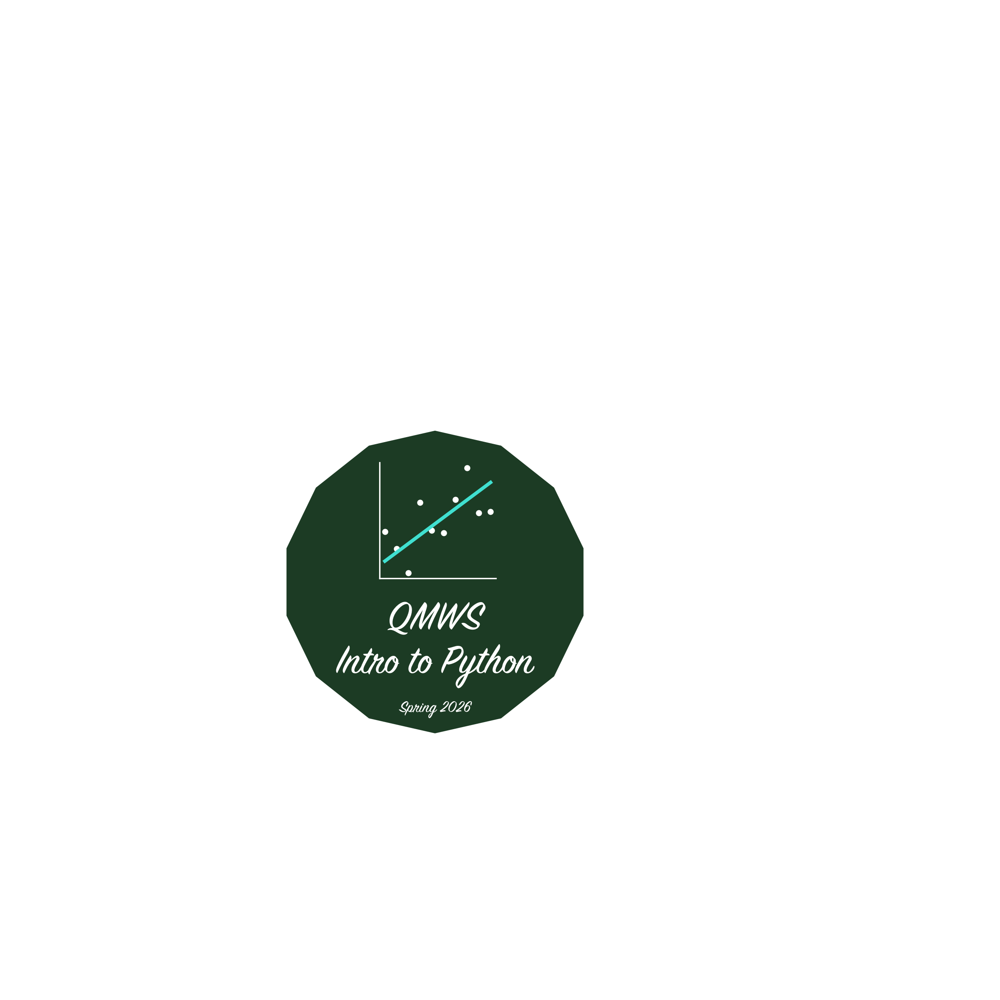

# Introduction to Python for Data Analysis <a href="images/logo.py"></a>

### A workshop offered through the [Spring 2026 *Quantitative Methods Workshop Series*](https://qm.info.yorku.ca/qmws/)

### Instructors:

<table align="center">
<tr>
<td>
Gavin Klorfine (<a href="https://www.github.com/gklorfine/">@gklorfine</a>)<br>
Graduate Student <br>
Department of Psychology <br>
York University, Canada <br>
<a href="mailto:gklorfin@yorku.ca">gklorfin@yorku.ca</a>
</td>

<td width="80"></td>

<td>
Deborah Laze (<a href="https://www.github.com/bora-laze/">@bora-laze</a>)<br>
Graduate Student <br>
Department of Psychology <br>
York University, Canada <br>
<a href="mailto:laze@yorku.ca">laze@yorku.ca</a>
</td>
</tr>
</table>

<br>

<i><strong>WORKSHOP IN PROGRESS | WORKSHOP IN PROGRESS | WORKSHOP IN PROGRESS <br> WORKSHOP IN PROGRESS | WORKSHOP IN PROGRESS | WORKSHOP IN PROGRESS</i></strong>

*Attendees are encouraged to read this entire document, as relevant information and resources are interspersed throughout. We also encourage attendees to look over the slides after each day, due to the large amount of material covered.*

<!-- GK: After the workshop, we could include a quote (or a few) from reviews here -->

This workshop takes place June 26, 27, and 28 from 11:30AM to 2:30PM over Zoom (the link was provided to attendees over email). Tickets for this workshop were sold out (26/25 spots filled)! After the third session, a link to a feedback form will be emailed to attendees (please fill this out!).

Starting with the installation of Python and relevant packages, this workshop guides attendees through basic programming structures/syntax, culminating in the manipulation and analysis of data. Interactive exercises will be available throughout the workshop to practice applying Python and data analysis skills and will serve as the building blocks for a short, end-of-workshop project. A digital credential is provided upon the successful completion of this project. This workshop is meant for those with no prior experience or exposure to Python (or programming, for that matter), although all levels are welcome.

Slides were made using the [**beamer**](https://ctan.org/pkg/beamer) format in [**Quarto**](https://quarto.org/), an open-source publishing system. You may see the 'behind the scenes' code for the slides by opening the `.qmd` files (either through Visual Studio (VS) Code or online via GitHub). This is also a good way to access the code displayed on each slide (tip: `CTRL + F` or `CMD + F` to search is useful here).

[ ] **TODO: Put where relevant information in the repo is here (e.g., where to access slides)**

## Resources

### Documentation:

- "How To Use Developer Documentation" by Codecademy ([YouTube video](https://www.youtube.com/watch?v=s1PLS3SQHQ0))

| **Resource** |                                                **Link**                                                |
| :----------- | :----------------------------------------------------------------------------------------------------- |
| **Package**  | |
| matplotlib   | [matplotlib.org/stable](https://matplotlib.org/stable)                                                 |
| NumPy        | [numpy.org](https://numpy.org/)                                                                        |
| pandas       | [pandas.pydata.org/docs](https://pandas.pydata.org/docs)                                               |
| statsmodels  | [statsmodels.org/stable](https://www.statsmodels.org/stable)                                           |
| **Software** | |           
| Python       | [docs.python.org](https://docs.python.org/)                                                            |
| Anaconda     | [docs.conda.io](https://docs.conda.io/)                                                                |
| VS Code      | [code.visualstudio.com/docs/introvideos/basics](https://code.visualstudio.com/docs/introvideos/basics) |


### Artificial Intelligence (AI) tools:

Though not covered in this workshop, AI tools can be very handy for programming. When using these tools, a few general guidelines include:

- Manually verifying that the code generated outputs what is expected (how exactly this is done varies case-by-case)
    + This is of the ***utmost importance*** when working with real data
- Understand what is generated. This may require reading documentation, watching videos, having the AI tool explain itself (using AI as a 'tutor'), etc.
    + Again, if the latter is chosen, be skeptical of the generated information
- Treating confidential information with the necessary care

Common uses for AI include:

- Debugging code (e.g., "Why won't this run?")
- Searching through documentation 
- Having it point you in the right direction (e.g., "How do I do $x$ in Python?")

Starting out, most problems encountered will be basic enough to handle through the familiar 'chat' interface. When problems span multiple files, tools such as [**ChatGPT Codex**](https://chatgpt.com/codex/) and [**Claude Code**](https://code.claude.com/docs/en/overview) are very useful. At the user's command, these tools are given access to the project directory and have the ability to modify code and create/remove files; however, many features are pay-walled (in the case of Claude Code, the entire thing is). *Both ChatGPT Codex and Claude Code may be integrated into VS Code as an 'extension'*.

### Further reading:

Although we cover a vast amount of material in this workshop, we only skim the surface of what Python has to offer. This said, we hope that this workshop enables you to feel comfortable seeking out and engaging with material beyond what we have taught. Some resources to do so are provided below:

- Sometimes, packages that you might want to install are not available through the Anaconda Navigator. I have included a guide as to how to install these in [`extras/pip-install.md`](extras/pip-install.md)

- Including the above bullet (on `pip install`), it is often helpful and/or necessary to use the terminal (or command prompt / PowerShell on Windows). A few resources on this include:
    + *Master the basics of Conda environments in Python* by E.M. Ratamero from The Jackson Laboratory ([YouTube video](https://www.youtube.com/watch?v=1VVCd0eSkYc))
    + *Absolute BEGINNER Guide to the Mac OS Terminal* by Percy Grunwald from TopTechSkills ([YouTube video](https://www.youtube.com/watch?v=aKRYQsKR46I))
    + *Windows PowerShell [01] Introduction* by John Hammond ([YouTube video](https://www.youtube.com/watch?v=TUNNmVeyjW0))

- **Dictionaries** were not explicitly touched upon in this workshop (though they will look familiar from the pandas section). These are variable types that contain "key-value" pairs, with values corresponding to their given key. A good resource on Python dictionaries is *Python dictionaries are easy 📙* by Bro Code ([YouTube video](https://www.youtube.com/watch?v=MZZSMaEAC2g))

- [**Jupyter Notebook**](https://jupyter-notebook.readthedocs.io/en/latest/) allows you to combine markdown text and Python code into a single file (like an `.Rmd` file in programming language **R**). A Jupyter Notebook has the file extension `.ipynb`. A good resource here is the "Jupyter Notebooks in VS Code" article in the VS Code documentation ([link](https://code.visualstudio.com/docs/datascience/jupyter-notebooks))

- **List comprehensions** are useful, compact ways of making lists in Python. You may find the *Learn Python LIST COMPREHENSIONS in 10 minutes! 📃* video by Bro Code helpful ([YouTube video](https://www.youtube.com/watch?v=YlY2g2xrl6Q))

- **Object-oriented programming (OOP)** and the use of **classes** in Python allow you to bundle related data and functionality. For example, a pandas `DataFrame` is a class that bundles both information on the data used (e.g., variable names, cell frequencies) together with functionality (e.g., `DataFrame.describe()` to get descriptive statistics). A good resource here is *Python Object Oriented Programming Full Course 🐍* by Bro Code ([YouTube video](https://www.youtube.com/watch?v=IbMDCwVm63M))

For more on the packages we covered in this workshop:

|     **Package**    | **Video** |
| :----------------- | :-------- |
| numpy              | *NumPy Tutorial: For Physicists, Engineers, and Mathematicians* by Mr. P Solver ([YouTube](https://youtu.be/DcfYgePyedM)) |
| pandas             | *Complete Python Pandas Data Science Tutorial! (2025 Updated Edition)* by Keith Galli ([YouTube](https://www.youtube.com/watch?v=2uvysYbKdjM)) |
| matplotlib.pyplot  | *Learn Matplotlib in 30 Minutes - Python Matplotlib Tutorial* by Tech with Tim ([YouTube](https://www.youtube.com/watch?v=7Lc2AxiM17o)) |
| statsmodels        | *statsmodels* by Data Science for Everyone ([YouTube](https://youtube.com/playlist?list=PLlbbWgBRF8EePgK40-i7aGU2_ky1yujgL&si=C27xUwIBMtQThYIu)) |

- [**Data Science Essentials with Python**](https://www.netacad.com/courses/data-science-essentials-with-python?courseLang=en-US) (pandas & matplotlib) from Cisco Networking Academy is an online course that provides interactive exercises as well as additional datasets that you can use to independently practice your Python skills

- Last, **Git/GitHub** offer a way to share your code and collaborate with others. You are reading a shared document on GitHub right now! A good beginner resource on using Git/GitHub is *Learn Git and GitHub in 1 Hour!* by Alex the Analyst ([YouTube video](https://www.youtube.com/watch?v=lLoJHifWTRw&t=345s))
    + If this interests you, I (GK) recommend learning how to use the terminal as well (or command prompt / PowerShell on Windows; see above for resources) 

### Other:

- [**PsychoPy**](https://psychopy.org/) for desigining psychological experiments (installing this as a package is finnicky; best used as a standalone development environment)

### Fun:

- The logo for this workshop was created using **matplotlib**. The script is located in this repo at [`images/logo.py`](images/logo.py). There are a couple of video resources included as comments within this script--I (GK) referred to these videos when making the logo and thought they might be of use to some
- [**pygame-ce**](https://pyga.me/docs/) for games
    + See *Introduction to Python for Data Analysis: The Game* under [`fun/`](fun/)

``` python
from pyfiglet import Figlet
f = Figlet(font = 'slant')
print(f.renderText("Thank you\n       for\nattending!"))
```

``` text
  ________                __                       
 /_  __/ /_  ____ _____  / /__   __  ______  __  __
  / / / __ \/ __ `/ __ \/ //_/  / / / / __ \/ / / /
 / / / / / / /_/ / / / / ,<    / /_/ / /_/ / /_/ / 
/_/ /_/ /_/\__,_/_/ /_/_/|_|   \__, /\____/\__,_/  
                              /____/               
                   ____          
                  / __/___  _____
                 / /_/ __ \/ ___/
                / __/ /_/ / /    
               /_/  \____/_/     
                                 
         __  __                 ___             __
  ____ _/ /_/ /____  ____  ____/ (_)___  ____ _/ /
 / __ `/ __/ __/ _ \/ __ \/ __  / / __ \/ __ `/ / 
/ /_/ / /_/ /_/  __/ / / / /_/ / / / / / /_/ /_/  
\__,_/\__/\__/\___/_/ /_/\__,_/_/_/ /_/\__, (_)   
                                      /____/      
```
