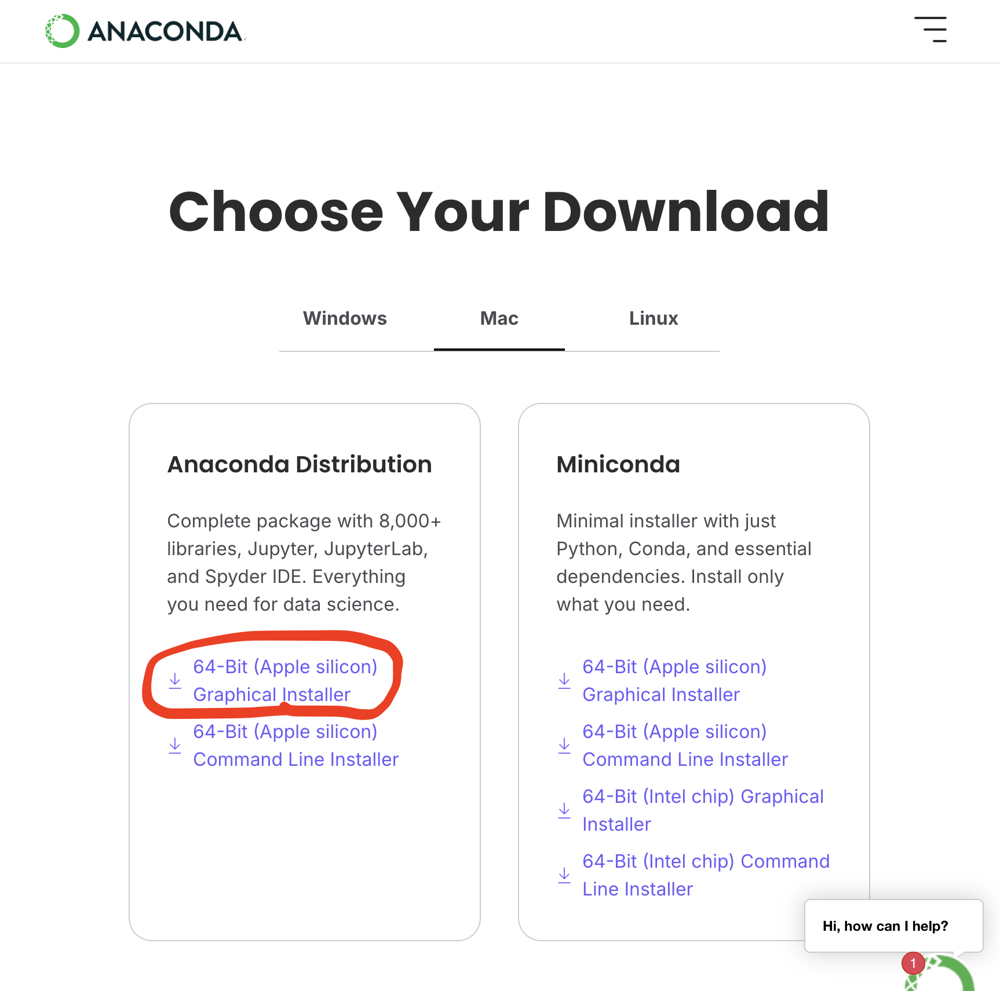
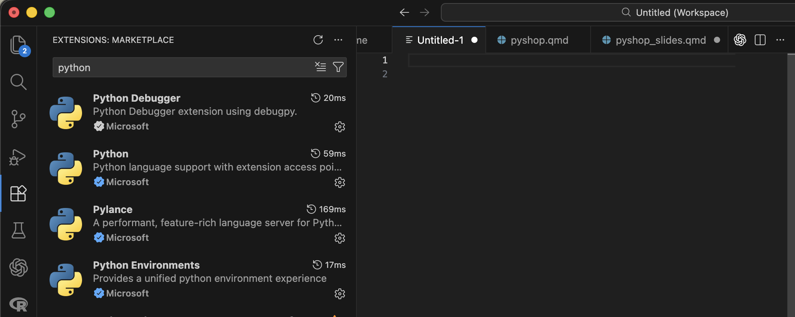

# Installation

## Anaconda
- A tool for configuring Python **environments**
    - More often than not, you need to install **packages** that allow you to code more easily/efficiently
    - Allows for version control
    - Issues can arise if environments are not used, for example:
        - If you install two packages that conflict with one another
        - If you install a package that requires a specific version of Python
    - Anaconda allows these issues to be isolated to a specific environment, rather than affecting your whole Python installation
        - Especially useful if you have more than one project going on

## Anaconda
- Installation link: https://www.anaconda.com/download
- The simplest way to use Anaconda is via the **Navigator**
- To install:
    1. Make an account
    1. Install the full distribution via the "Graphical Installer"

---

- Installation link: https://www.anaconda.com/download
- On Mac:

{fig-align="center"}

---

- Installation link: https://www.anaconda.com/download
- On Windows:

{fig-align="center"}

## Visual Studio (VS) Code
- Installation link: https://code.visualstudio.com/download
- Integrated Development Environment (IDE)
- Can use it to code in many different languages
- Commonly used in both academia and industry

## Visual Studio (VS) Code
- Once installed, go to the "Extensions" tab and search "Python"
- Install the below extensions:

{fig-align="center"}

## Visual Studio (VS) Code

Addition after first session (June 26th, 2026):

- Make sure to install the **Jupyter** extension as well, which will allow you to use Jupyter notebooks in VS Code

## Stop here!

If you:

1. Are able to open the **Anaconda Navigator**
1. Have installed **VS Code and the listed extensions**

You are ready for the workshop! We will cover next steps at the beginning of the first session.

Else, please email either of us for help:

- Gavin (gklorfin\@yorku.ca)
- Bora (laze\@yorku.ca)

## Setting Up a Conda Environment 
- See the presenter's shared screen
    + We will install the **ipykernel** package, allowing us to use **Jupyter notebooks** in VS Code (more on this in a few minutes)

## Visual Studio (VS) Code
- To point VS Code to your new Conda environment:
    1. Open the Command Palette 
        a. `Ctrl + Shift + P` on Windows 
        b. `Command + Shift + P` on MacOS
    1. Search "Python: Select Interpreter"
    1. Select the interpreter that corresponds to your new environment (the name of the environment will be in parentheses)

## Using Python

### Scripts
- To create a new Python script (a file with a `.py` extension):
    1. File -> New File -> Python File
- These scripts are generally executed from top to bottom, and are useful for writing longer chunks of code
- You can run a script with the play button in the top right corner of VS Code

. . .

### Console
- The console is useful for executing smaller bits of code
- To open the console:
    1. Open the Command Palette -> search "Python: Start Terminal REPL"
- Type in a line of code and hit `enter` (or `return` on MacOS) to execute it

## Using Python

### Jupyter Notebooks
- **Jupyter notebooks** are a great way to combine code, text, and visualizations in one file
- To create a new Jupyter notebook (a file with a `.ipynb` extension):
    1. File -> New File -> Jupyter Notebook
    2. Set the **kernel** to the Conda environment you created earlier
- Notebooks are composed of **cells** that can be run independently of one another.
    + Cells can either be **code** or **markdown** (text)
- Click the play button beside a given cell to run it

# The Basics

## Variables
- In programming, a variable is a space in computer memory where values may be stored

### Defining and Printing Variables {.example}
```{python}
#| label: defPrint

x = 10

print(x)
```

## Variables

- Variable names should be short but descriptive (e.g., a variable for the mean of `x` should be named `mean_x`)
    + We are using `x` for pedagogical purposes... In practice, `x` is likely non-descriptive! \pause
- When a variable name contains multiple words (e.g., apple size), there are a couple of approaches:
    + Use an underscore (e.g., `apple_size`)
    + Use "camel case" (e.g., `appleSize`)
        + Camel case has the first word all lowercase, with subsequent words having their first letter capitalized \pause
- If a variable is not meant to change, it is called a constant. These variables are usually named in all-caps, e.g.:

```{python}
#| label: constant

PI = 3.14
```

## Variables

::: {.callout-important}
- Variable names cannot contain spaces (hence the use of camelCase and underscores) \pause
- Variable names cannot start with a number \pause
- Avoid naming variables with names that have already been "taken"
    + E.g., do not name a variable "`print`"
    + We will encounter more names that have been "taken" \pause
- Do not capitalize the first letter of a variable unless it is a `class` (beyond the scope of this workshop)
:::

## Variables
### Arithmetic {.example}
```{python}
#| label: arith

a = 1
b = 2

print(a + b)    # * for multiplication, / for division
```

::: {.callout-note}
- Use `#` to make a **comment**
:::

## Variables

### Updating Variables {.example}
```{python}
#| label: upVar

x = 10
x = 20
x = 15

print(x)
```


## Variable Types
1. `int` (integer; "whole number")
    - less memory <!-- GK: maybe can just mention this and not have on slide? -->
    - 1 is an `int`
1. `float` (real; "decimal number")
    - 1.2 is a `float`
    - 1.0 is a `float`
1. `str` (string; characters/words with no numerical meaning)
    - `"Hello world!"` is a string
    - `"416-767-6767"` is also a string
1. `bool` (boolean; can be `True` or `False`; more on this later)
1. `None`
    - A special type of variable that essentially means "nothing meaningful is stored"
    - Useful as a placeholder

## Variable Types
### Checking Type {.example}
```{python}
#| label: checkType

x = 416
print(x, type(x))   # type() to check type
```

### Converting Type {.example}
```{python}
#| label: convType

x = 416
x = str(x)      # str() to convert to string
print(x, type(x))
```

- Can also use `int()` and `float()` to convert to respective type

## A Brief Note
- `print()`, `type()`, `str()`, etc. are all examples of **functions**
    - These are essentially pre-made chunks of code for you to use
    - More on this later!

### What will the below code output?
```{python}
#| label: typePrint_q
#| output: False

x = "Variable"

print(type(x))
print(x)
```

# More Advanced Variable Types

## Lists
- Multiple values can be stored in one variable. A list is one way to do this:

### Defining Lists {.example}
```{python}
#| label: listType

x = [0, 1, 2, 3, 4]     # Define a list; square brackets
print(type(x))
```

## Lists: Indexing
```{python}
#| label: listToStareAt

x = [0,1,2,3,4]
```

- To extract one or more values from a list, you **index** the list
- Python uses **zero-based indexing**
    - This means that the first element of a list is index `0`, the second element is index `1`, ...
    - Element $x$ is index $x - 1$

## Lists: Indexing
### Indexing Lists {.example}
```{python}
#| label: listIndex

x = [0, 1, 2, 3, 4]
y = 2

print(x[0])     # Index first element of a list
print(x[-1])    # Index last element
print(x[y])     # Index yth element
```

## Lists: Indexing
- You can also take more than one element, or a **slice**, of the list

### Slicing Lists {.example}
```{python}
#| label: listSlice

x = [0, 1, 2, 3, 4]

print(x[0:2])   # First and second (but not third) elements
```

::: {.callout-important}
- `[inclusive:exclusive]`
    - The index on the *left-hand* side of the slice is *included*, whereas the index on the *right-hand* side of the slice is *excluded*
:::

## Lists: Indexing

### Slicing Lists, continued {.example}
```{python}
#| label: slicingCont

x = [0, 1, 2, 3, 4]

print(x[0:3]) # First three elements
print(x[0:1]) # Silly way to index just the first element
```

## Lists: Length
- To find the length of a list:

### `len()` function {.example}
```{python}
#| label: lenFunc

x = [0, 1, 2, 3, 4]

print(len(x))   # The length of list x

# Another way to find the last element (not so silly!)
print(x[len(x) - 1])
```

## Lists: Methods
- Lists have certain functions that can be applied to them, called **methods**
    - Methods are more general than this (e.g., string methods; more on these in a little bit!)

### `.append()` {.example}
```{python}
#| label: listAppend

x = [0,1,2,3,4]

x.append(5)
print(x)
```

- Adds an entry to a list

## Lists: Methods

### `.extend()` {.example}
```{python}
#| label: listExtend

x = [0,1,2,3,4]

x.extend([6,7,8,9])
print(x)
```

- Extend a list by "glueing" it to another list

## Lists: Methods

### Difference Between .append() and .extend() {.example}
```{python}
#| label: appExtDiff

x = [0,1,2,4]
y = [5,6,7,8]

x.append(y)
print(x)

x = [0,1,2,4]   # Redefine x
x.extend(y)
print(x)
```

## Lists: Changing Values

### Changing a Value in a List {.example}
```{python}
#| label: changeList

x = [0, 1, 2, 3, 4]

x[0] = 9
print(x)
```

## Tuples

- Like lists, tuples contain multiple values
- Unlike lists, tuples are **immutable**; they cannot be changed once created.
    - Lists are *mutable*

### Defining a Tuple {.example}
```{python}
#| label: tupleDef

x = ("a", "tuple")  # Round brackets

print(x[0], x[1])
print(type(x))
```

## Tuples

### Changing Values... ERROR! {.example}
```{python}
#| label: tupleError
#| error: True

x = ("a", "tuple")

x[0] = "Not a"
```

## Tuples

- Tuples have special properties, one of which is below:

### Unpacking Tuples {.example}
```{python}
#| label: unpack

x, y = (6, 7)

print(x)
print(y)
```

# Strings

## Strings

- Strings are a lot like lists in that they are **iterable**
    - For now, think of these (lists, strings) as a sequence of values

### Strings are Like Lists! {.example}
```{python}
#| label: stringList

cringe = "Hello world!"

print(cringe[0:5])
print(len(cringe))
```

## Strings

- We can join two strings together through **concatenation**

### Concatenation {.example}
```{python}
#| label: concat

a = "Hello"
b = "World!"

c = a + " " + b     # Note the space between words
print(c)
```

## Strings

- Sometimes you need to include quotations or other characters inside a string that would normally return an error
- This can be done through an **escape sequence**

### ERROR! Why You Need Escape Sequences... {.example}

```{python}
#| label: err_escSeq
#| error: true

x = "This is a "string""
```

## Strings
### Escape Sequences {.example}
```{python}
#| label: escSeq

x = "This is a \"string\""
print(x)
```

::: {.callout-note}
- The `\` indicates the start of an escape sequence
:::

## Strings

- Strings are also kind of like tuples in that they are **immutable**

### String Immutability {.example}
```{python}
#| label: strImmutable
#| error: true
cringe = "Hello world!"
cringe[0:5] = "Goodbye"     # Error
```


## Strings
- We can turn to string **methods** to "modify" strings when needed (they just create a new string "behind the scenes")

### `.replace()` {.example}
```{python}
#| label: strReplace

cringe = "Hello world!"

print(cringe.replace("Hello", "Goodbye"))
```

## Strings

### `.split()` {.example}
```{python}
#| label: strSplit

meme_str = "Harambe, 67, Jar Jar Binks, The Rizzler"

# Split on ", "; returns a list
new_list = meme_str.split(", ")

print(new_list)
print(new_list[0]) # Index the list
```

## Strings

### How might you index "The Rizzler"?
```{python}
#| label: rizzIndex1

meme_str = "Harambe, 67, Jar Jar Binks, The Rizzler"
new_list = meme_str.split(", ")
```

. . .

```{python}
#| label: rizzIndex2

print(new_list[3])
print(new_list[-1])
print(new_list[len(new_list) - 1])
```

## Strings

- If you wanted to include variables within text, format strings as per the following:

### f-string Example {.example}
```{python}
#| label: fString

PI = 3.14159

print(f'Approximate value of pi is {PI}')

print(f'To three decimal places is {PI:.3f}') 
```

## Strings

- The string (surrounded by either single `''` or double `""` quotations) is preceded by `f`
- The variable is surrounded by curly braces `{}` within the string
- Formatting is applied to the variable *within the curly braces*
    - A `:` signals that the proceeding formatting code should be applied to the variable

### f-string Formatting Basics
- `PI:.3f`
    - Format variable `PI`
    - Round to 3 decimal places
    - `f` means `float`

# Booleans

## Booleans
- A boolean variable (type `bool`) can be either `True` (`1`) or `False` (`0`).

### Booleans {.example}
```{python}
#| label: booleans

x = True
y = 10
print(type(x), type(y))

print(y > 5)
print(y < 5)
print(type(y < 5))
```

## Booleans

### Booleans {.example}
```{python}
#| label: boolCont

x = 5
y = 10

print(x == 5)
print(x > 2 and y > 2)  # Both need to be True
print(x > 2 and y < 2)
print(x > 2 and not y < 2)
print(x > 2 or y < 2)   # At least one needs to be True
```

## Booleans

:::: {.columns}
::: {.column width = "40%"}
### Comparison Operators
- `>` greater than
- `<` less than
- `>=` greater than or equal to
- `<=` less than or equal to
- `==` equal to
- `!=` not equal to
:::
::: {.column width = "40%"}
### Logical Operators
- `and`
- `or`
- `not`
:::
::::

# Conditional Statements

## Conditional Statements
- If thing1 happens, do $x$
- If thing2 happens instead, do $y$
- Otherwise, do $z$

. . .

### Basic `if`/`elif`/`else` {.example}
```{python}
#| label: condns

x = 10  # Value presumably unknown
y = 20

if x == 4:
    print("x is 4")
elif x > y:
    print("x is bigger than y")
else:
    print("none of the above")
```

## Conditional Statements
### Structure of Conditionals
```{python}
#| label: condns_struc
if x == 4:
    print("x is 4")
```
- Begins with `if`/`elif` ("else if")/`else`
- Boolean expression/value
- Colon `:`
- Indented code underneath that runs if condition is met

# Loops

## `while` Loops

- Loops are used to run a chunk of code repeatedly
    - Often a set number of times
- This is best shown and unpacked through examples:

## `while` Loops

### `while` Loop Basics {.example}
```{python}
#| label: while_basic
count = 1   # Initialize counter

while count <= 5:
    print(count)
    count = count + 1   # Increment counter
```

## `while` Loops

### Iterating through a list {.example}
```{python}
#| label: whileList

x = [0,1,2,3]
count = 0

while count <= len(x) - 1:
    print(x[count])
    count += 1    # Same as count = count + 1
```

## `while` Loops

- The `break` statement is used to exit a loop

### `break` {.example}
```{python}
#| label: breaks

x = 0

while True:     # Infinite loop...
    if x > 10:
        break   # Until you break!
    x += 1

print(x)
```

## `for` Loops
- Often used with the `range()` function to loop over code a set number of times

### `for` Loops, `range()` {.example}
```{python}
#| label: forRange

for i in range(3):
    print(i)
```

## `for` Loops

### Iterating Over Entries in a List {.example}
```{python}
#| label: forList

x = [10,20,30,40]

for i in x:
    print(i)
```

## `for` Loops

- Use `enumerate()` and a second indexing variable (usually `i` or `j`) if you want to keep variable position

### `enumerate()` {.example}
```{python}
#| label: enumerate

x = [10,20,30,40]

for i, j in enumerate(x):
    print(i, j)
```

## `for` Loops
- Loops (and conditionals) may be nested inside one another (like Russian dolls / Matryoshka)

### Nesting {.example}
```{python}
#| label: nesting

x = ["big", "small"]
y = ["cat", "dog"]

for i in x:
    for j in y:
        print(i, j)
```