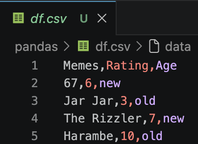

# Importing Packages, Defining Functions

## Importing Packages
- Packages add "extra stuff" to Python, including functions, constants, and more
- Some packages are installed with Python by default, and no extra work is required to use them

### `import math` {.example}
```{python}
#| label: importMath

import math

print(f'pi = {math.pi:.3f}')
```

## Importing Packages
- We can "rename" packages to make their usage more concise

### "Renaming" Packages {.example}
```{python}
#| label: impAs

import math as m

print(f'pi = {m.pi:.3f}')
```

## Importing Packages

- Some require installation. This is most easily (and safely) done through **Anaconda**
- Let's install the package **NumPy**!

<!-- GK: Share screen here and show how to add numpy to environment -->

## Importing Packages
### `import numpy as np` {.example}
```{python}
#| label: impNumPy

import numpy as np      # Common convention

# Take a sample of 3 values from N(0, 1)
print(np.random.normal(loc = 0, scale = 1, size = 3))
```

::: {.callout-note}
- `loc` = $\mu$, `scale` = $\sigma$
:::

## Importing Packages

- A brief aside:
    + Let's say of all the functions in **NumPy**, you only care about `numpy.random.normal`

### `from ... import ...` {.example}

```{python}
#| label: fromImport

from numpy.random import normal

# Same thing, but no `np.random` at the start
normal(loc = 0, scale = 1, size = 3)
```

## Defining Functions
- Sometimes you repeat the same code over and over again
    - When this happens, it is useful to collapse the repeated code into a function
    - Otherwise, code becomes long and messy due to copy-pasting \pause
    - For instance, imagine needing to know how to code your own `np.random.normal()` function and then copy pasting this code every time you want to use it

## Defining Functions

### Defining Basic Functions {.example}
```{python}
#| label: basicFuncs

def addition(a, b):
    return a + b              # What the functions spits out

print(addition(a = 1, b = 5)) # Call function

def subtraction(a, b = 1):    # Give b default value of 1
    return a - b

print(subtraction(a = 5))
```

## Defining Functions

### Basic Structure of a Function

```{python}
#| label: funcStruc
#| eval: false

# "arg" short for "argument"
def function_name(arg1, arg2 = default_value, arg_n):
    return output
```

## Defining Functions

### Function Example {.example}
```{python}
#| label: def

x = [0,1,2,3,4,5,6,7]

def qm_mean(things):
    sum = 0

    for i in things:
        sum += i
    
    return sum / len(things)

qm_mean(x)              
```

# NumPy

## NumPy

- Somewhat similar to MATLAB if you have used that
- Useful for working with arrays/matrices
- Stands for \textcolor{red}{\textbf{Num}}erical \textcolor{red}{\textbf{Py}}thon
- Based in computer language **C**
    - Faster, more efficient computations

## NumPy

### Working With Lists/Arrays {.example}
```{python}
#| label: listArray

import numpy as np

list1 = [1,2,3,4]
print(list1 * 2)
print(type(list1))

numpyList = np.array(list1)  # Convert list -> numpy array
print(numpyList * 2)
print(type(numpyList))
```

## NumPy

- Matrices are typically worked with as **2D** numpy arrays

### 2D NumPy Arrays {.example}
```{python}
#| label: 2d

array2d = np.array([[1,2,3], [4,5,6]]) # List of lists
print(array2d)
print(type(array2d))
```

## NumPy

### To Check Attributes of a NumPy Variable {.example}
```{python}
#| label: attrib_numpy

array2d = np.array([[1,2,3],  # Matrices typed in a more
                    [4,5,6]]) # appealing manner

print(array2d.shape)    # Shape (# rows, # columns)
print(array2d.ndim)     # Number of dimensions
print(array2d.size)     # Number of elements
print(array2d.dtype)    # Type of elements
```

## NumPy
- Some numpy types:
    - `uint8`
    - `int32`
    - `int64`
    - `float64`
- Generally, numpy type = type learned before + memory (in bits)

::: {.callout-note}
- The `u` in `uint8` stands for "unsigned," meaning that the variable can only store positive values
:::

## NumPy

### `np.arange()` {.example}
```{python}
#| label: arange

np.arange(start=10, stop=20, step=2, dtype = "int64")
```

::: {.callout-note}
- `stop` parameter is *exclusive*
:::

## NumPy

### `np.linspace()` {.example}
```{python}
#| label: linspace

np.linspace(start=10, stop=20, num=6, dtype = "int64")
```

::: {.callout-tip}
- Use `np.linspace()` for breaking something into equal parts
- Use `np.arange()` for creating a sequence of numbers
:::

## NumPy

- NumPy has lots of functions relating to choosing random values 

### Random Choice {.example}
```{python}
#| label: randChoice

print(np.random.choice(["A", "B", "C", "D"]))

print(np.random.choice(["A", "B", "C", "D"], size = 2))
```

## NumPy
### Random Numbers {.example}
```{python}
#| label: randNum

print(np.random.normal(loc = 0, scale = 1, size = 3))
print(np.random.uniform(low = 0, high = 10, size = 3))
```

## NumPy

- To make the values from these random functions reproducible, we set a "seed"
    + i.e., the first time the below `np.random.choice()` call is run will always return `'D'`, the second time `'B'`

### Setting a Seed {.example}
```{python}
#| label: setSeed

np.random.seed(67)

# 1st time returns 'D'
print(np.random.choice(["A", "B", "C", "D"])) 

# 2nd time returns 'B'
print(np.random.choice(["A", "B", "C", "D"]))
```

## NumPy
### Indexing NumPy Arrays {.example}
```{python}
#| label: indexNumPy

x = np.random.normal(0, 10, size=(3,3))
print(x, "\n")  # Print x with a blank line after it

print(x[2,2], type(x[2,2]))
print(x[2,:])   # Row 2 (zero-based), all columns
```

## NumPy
### Indexing (cont.) {.example}
```{python}
#| label: indexCont

x = np.random.normal(0, 10, size=(3,3))
print(x, "\n")

print(x[2, 0:2])    # Row 2, columns 0 and 1
print(type(x[2, 0:2]))
```

## NumPy

- You may also perform **aggregate** functions on numpy arrays

### NumPy Aggregate Functions {.example}
```{python}
#| label: nump_agg

x = np.array([1,4,7,15])

print(np.mean(x))
print(np.median(x))
print(np.std(x))
```

## NumPy

### More Aggregate Functions {.example}
```{python}
#| label: nump_agg_more

x = np.array([1,4,7,15])

print(np.min(x))        # Minimum value
print(np.argmin(x))     # Position of minimum value
print(np.max(x))        # Maximum value
print(np.argmax(x))     # Position of maximum value
```

## NumPy
### Check-in
- How might you generate 100 random values from the standard normal distribution?
- How might you get the maximum of these values?

. . .

```{python}
#| label: maxNorm

np.max(np.random.normal(loc=0, scale=1, size=100))
```

# pandas

## pandas

- For the analysis of spreadsheet-like data in Python
- Somewhat similar to **R** if you have used that
    - Introduces the `DataFrame`

## pandas

### Creating a `DataFrame` {.example}
```{python}
#| label: pandas_df

import pandas as pd
df = pd.DataFrame({
    "Memes" : ["67", "Jar Jar", "The Rizzler", "Harambe"],
    "Rating": [6, 3, 7, 10],
    "Age"   : ["new", "old", "new", "old"]
}, index = ['a','b','c','d']) # Index is optional
df # To print
```

## pandas

- Data are commonly stored as `.csv` files
    + \textcolor{red}{\textbf{C}}omma \textcolor{red}{\textbf{s}}eparated \textcolor{red}{\textbf{v}}alues
- These files have entries separated by commas, often including a first row of "header" entries
- A `.csv` file of the **pandas** `DataFrame` from the previous slide (variable `df`) is shown below

{fig-align="center" height="128px"}

## pandas

- Continuing with the `df` `DataFrame`, the below shows how a `.csv` file is written

### Writing `.csv` Files {.example}
```{python}
#| label: csvWrite

# Write df.csv to the pandas/ folder
df.to_csv("pandas/df.csv", index = False)
```

- Here, `to_csv` is a **method** acting on the `df` **object** (or variable)

::: {.callout-tip}
Setting the `index` argument to `False` removes row indices (i.e., row 0, 1, 2, ..., $n$) from being stored as a separate column
:::

## pandas

- We often need to do the reverse; namely, reading data from a `.csv` file into a **pandas** `DataFrame`

### Reading `.csv` Files {.example}
```{python}
#| label: csvRead

# Read df.csv from the pandas/ folder
df_new = pd.read_csv("pandas/df.csv") 

df_new
```

## pandas
- **pandas** also has functions to read/write data from other file formats, such as from Microsoft Excel `.xlsx` files

### `.xlsx` Files {.example}
```{python}
#| label: xlsxRead
#| eval: False

excelDat = pd.read_excel( # Read
    "file_name.xlsx", sheet_name = "optional"
)

excelDat.to_excel( # Write
    "folder/excelDat.xlsx", sheet_name = "optional"
)
```

## pandas

### Inspecting Data {.example}
```{python}
#| label: inspectHead

df.head(2) # First 2 rows
```

```{python}
#| label: inspectTail

df.tail(2) # Last 2 rows
```

## pandas

### Inspecting Data {.example}
```{python}
#| label: inspectInfo

df.info()
```

## pandas

### Descriptives {.example}
```{python}
#| label: describe

df.describe()
```

## pandas

### Grouping {.example}
```{python}
#| label: groupbyDescribe

df.groupby("Age").describe()
```

## pandas

### Selecting a Column {.example}
```{python}
#| label: selectCol

df["Memes"]
```

## pandas

### A Note on Types
```{python}
#| label: series

type(df["Memes"])
```

- A variable of type `pandas.Series` is essentially a column of a **pandas** `DataFrame`

## pandas

- To select multiple columns, provide a list of column names as the index

### Selecting Multiple Columns {.example}
```{python}
#| label: selectCols

df[["Memes", "Age"]]
```

## pandas

- A simple way to filter rows is by row number:

### Filter Rows by Row Number {.example}
```{python}
#| label: simpleRowFilter

df[0:2] # Row numbers 0 and 1
```

## pandas

- You can also filter rows by indexing a `DataFrame` with a boolean expression involving the same `DataFrame`

### Filter Rows With Boolean Expressions {.example}
```{python}
#| label: filterBoolean

df[df["Age"] == "old"]
```

## pandas

- The result of the previous slide was also a `DataFrame`!
    + This means we can index it further by, say, taking the `"Memes"` column:

### Indexing Twice {.example}
```{python}
#| label: indexTwice

df[df["Age"] == "old"]["Memes"]
```

## pandas

- This also means that methods shown previously can be applied to these filtered `DataFrame`s

### Describing Filtered Data {.example}
```{python}
#| label: describeFilt

df[df["Age"] == "old"].describe()
```

## pandas

- We can also select rows and columns using the `loc` or `iloc` **attributes**
    + These are similar to methods but use square `[]` brackets (instead of round brackets `()`)

::: {.callout-note}
A brief note on terminology:
- The distinction between *methods* and *attributes* is that an attribute gives access to information associated with a variable; whereas a method is a function that may act on/with the variable.
    + E.g., `.loc` versus `.mean()`
:::

### Selecting with `loc` and `iloc` {.example}
```{python}
#| label: locSelect1

df.loc["b", "Memes"] # Row b of Memes column
```

```{python}
#| label: ilocSelect1

df.iloc[1,0] # Row 1 of 0th column (Memes)
```

## pandas

- Like **NumPy**, we can use a colon (`:`) with `loc` and `iloc` to indicate "all rows" or "all columns":

### Selecting All Rows with `loc` {.example}
```{python}
#| label: locSelect2

df.loc[:, "Memes"] # All rows of Memes column
```

## pandas

### Selecting All Columns with `iloc` {.example}
```{python}
#| label: ilocSelect2

df.iloc[0] # All columns for 0th row (row 'a')
```

::: {.callout-note}
- If only the row argument is supplied, all columns are selected by default
    + This is also true for `loc`
:::

## pandas

- If you would like to select multiple columns (or rows), but not all columns (or rows), pass a `list` to `loc` or `iloc`

### Selecting Multiple (Specific) Columns with `loc` {.example}

```{python}
#| label: locSelect3

df.loc[["a", "b"], ["Memes", "Age"]]
```

- Same thing for `iloc`, but with row numbers instead of indices/names

## pandas

- We can also use boolean expressions with `loc` (but not `iloc`):

### Boolean Expressions with `loc` {.example}
```{python}
#| label: locBoolean1

# Take rows where age is old and just the meme column
df.loc[df["Age"] == "old", "Memes"] # Old memes!
```

## pandas

- In these boolean expressions, we can use `&` for `and`, `|` for `or`, and `~` for `not`
    + We need these special operators as we are comparing entire columns as opposed to single values
    + We also surround expressions to be compared in round brackets `()`

### Boolean Expressions with `loc` {.example}
```{python}
#| label: locBoolean2

# Take all rows where age is old and rating is larger than 7
df.loc[(df["Age"] == "old") & (df["Rating"] > 7), :]
```

## pandas

```{python}
#| label: display_df
#| echo: false

df
```

### How might I index rows with rating greater than or equal to seven?

- I want 2 different answers! (Hint: `loc` and `df[?]`)

## pandas

### How might I index rows with rating greater than or equal to seven?

```{python}
#| label: pd_question1

df[df["Rating"] >= 7]
df.loc[df["Rating"] >= 7, :] # The `, :` is optional
```

## pandas

- To show a peculiarity of pandas, I first set the index of our data frame `df` (e.g., the row names `"a"`, `"b"`, ...) back to integers (the default)

### Changing the Index {.example}
```{python}
#| label: changeIndex

df.index = [0,1,2,3]
df
```

## pandas

- When using `loc` on a data frame with a numeric index, the format of a slice is `inclusive:inclusive`

### `loc` is Strange {.example}
```{python}
#| label: locStrange

df.loc[0:1] # inclusive:inclusive
```

## pandas

- For reference, here is the same line but using `iloc` instead of `loc`:

### `iloc` is Typical {.example}
```{python}
#| label: ilocUsual

df.iloc[0:1] # inclusive:exclusive
```

## pandas

- We can also add columns to our data frame. Here I add a column `r10`: the `Rating` out of `10`

### Adding a Column {.example}
```{python}
#| label: addCol

df["r10"] = df["Rating"] / 10
df
```

## pandas

- We might also want to sort these entries by `Rating`

### Sorting a Data Frame {.example}
```{python}
#| label: sort1

df.sort_values(by = "Rating", inplace = True)
df
```

- Argument `inplace = True` modifies `df` directly instead of returning a new one

## pandas

- We can also sort by `Age` first and then `Rating`
    + Strings are sorted \underline{alphabetically}

### Sorting by a List {.example}
```{python}
#| label: sort2

df.sort_values(by = ["Age", "Rating"], inplace = True)
df
```

## pandas

- Instead of using the `describe()` method, you may want only a select few (or one) statistic

### Getting Specific Descriptive Statistics {.example}
```{python}
#| label: specDesc_mean

df["Rating"].mean()
```

```{python}
#| label: specDesc_std

df["Rating"].std()
```

## pandas

### Getting Specific Descriptive Statistics {.example}
```{python}
#| label: specDesc_agg

df["Rating"].agg(['mean', 'std']) # agg = aggregate
```