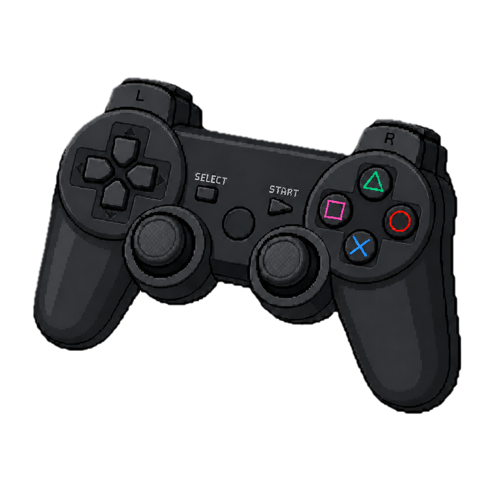

# The Fun Folder! 

There is more to Python than just data analysis!

This folder contains *Introduction to Python for Data Analysis: The Game*. Code can be found in [game.py](game.py).

To run the game, download both [game.py](game.py) and the [assets/](assets/) folder (plus its contents) into the same folder. Run [game.py](game.py) after this (you will need to install package [**pygame-ce**](https://pyga.me/docs/) in addition to packages covered in the workshop).